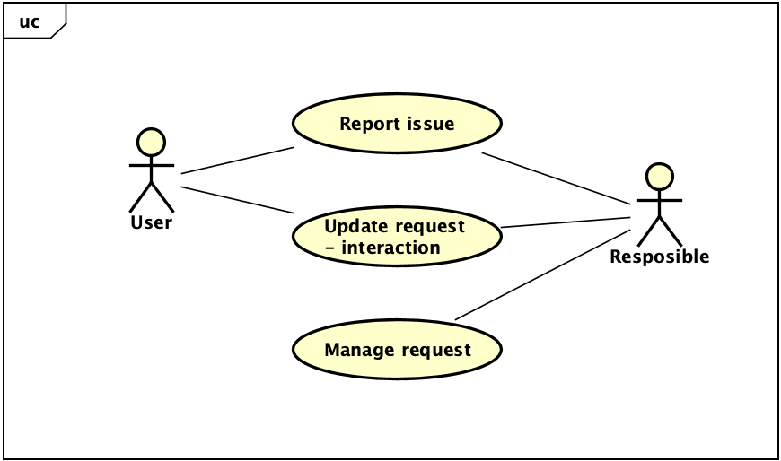
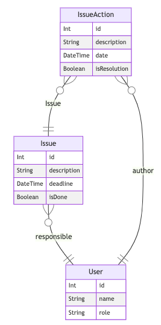

Challenge to create a help request tool aimed to evaluate dev skills.

# The project
The user should be able to
- Send a issue request to a responsible
- See issues opened, done and overdued
- Interact with an issue

### Use cases

### Data modeling

## 🧪 Technologies used
- Node JS
  - [Prisma ORM](https://www.prisma.io/)
  - Express
- React JS - built on [Vite](https://vitejs.dev/guide/why.html)
  - [Styled-components](https://styled-components.com/)
  - Axios
- MySQL 

## 🔥 How to run the project
### Setup to run the API 
With [NodeJS installed](https://nodejs.org/en/download/), on terminal at root folder:
- Navigate to api folder with ``cd node-api && npm i`` to intall all dependencies.
- Run ``touch .env`` to create a `.env` and set the database connection URL for Prisma to work ([more here about connectors](https://www.prisma.io/docs/concepts/database-connectors)).
- With the ``DATABASE_URL`` defined, type ``prisma migrate dev`` to run migrations and setup database structure to work. 

### To run the frontend 
Here the work is simplier, just run ``cd frontend && npm run dev``.